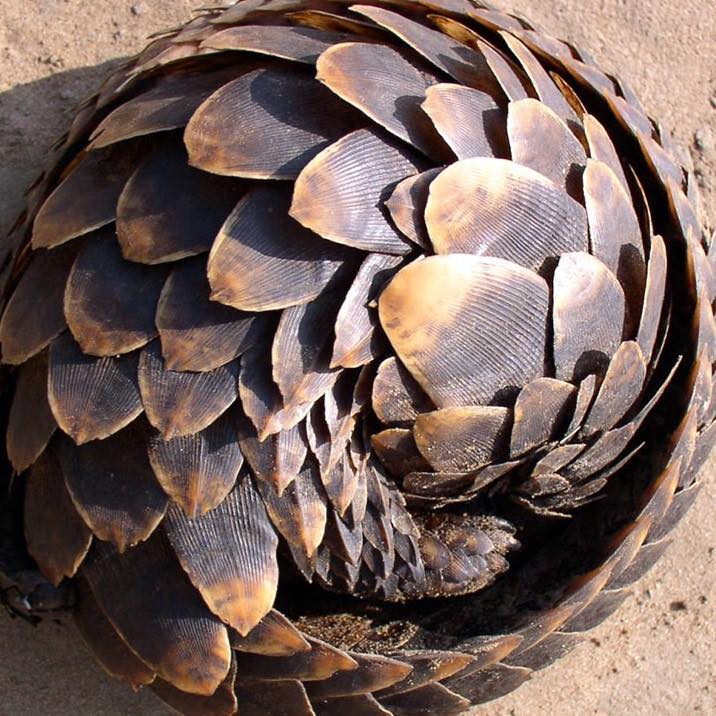

# ART6200-OpenSCAD-FocalSpiritOneRepair

Pièce femelle pour réparation d'arceau de casque focale Spirit One
Un bon casque que j'ai acheté il y a un moment et qui s'est rapidement cassé, sans prise en charge de la garantie
J'ai déjà essayé de le réparer à l'imprimante 3D mais celle que j'avais à disposition n'était pas de bonne qualité, lapièce se déformait et n'étaitaps fidèle au modèle que j'avais fait sur sketchup
Donc une très bonne raison de la réaliser ici. 
Voici les photos des pièces cassées : 
