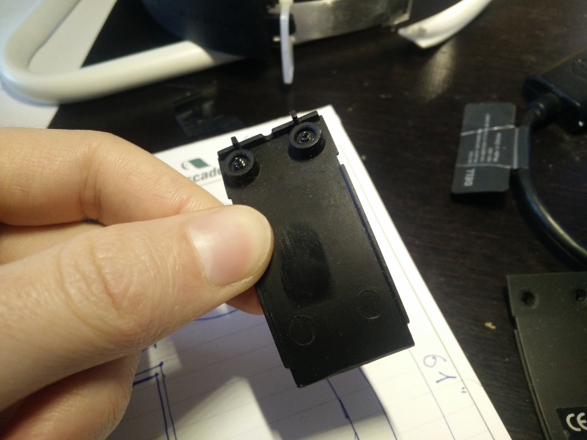
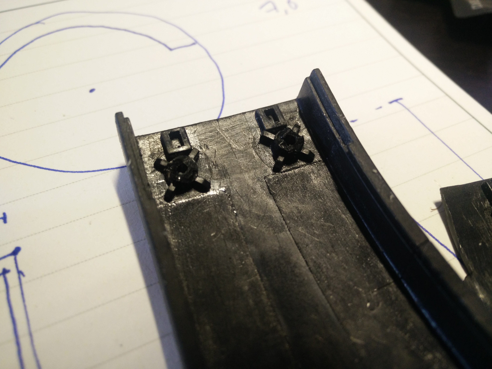
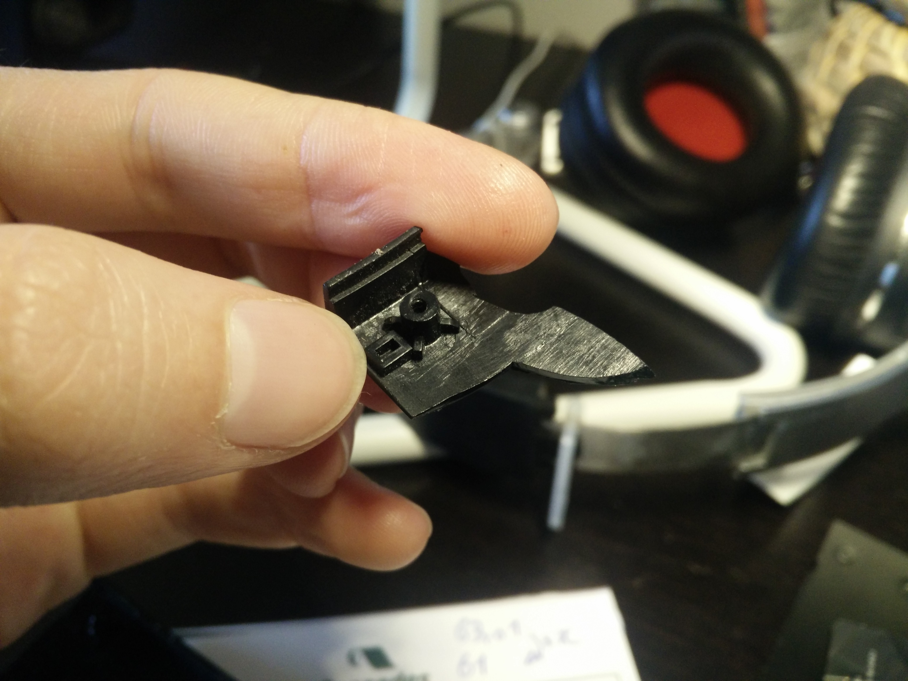

# ART6200-OpenSCAD-FocalSpiritOneRepair

Réalisé avec openSCAD : https://github.com/openscad/openscad

Pièce femelle pour réparation d'arceau de casque focale Spirit One.
Un bon casque que j'ai acheté il y a un moment et qui s'est rapidement cassé, sans prise en charge de la garantie. 
J'ai déjà essayé de le réparer à l'imprimante 3D mais celle que j'avais à disposition n'était pas de bonne qualité, la pièce se déformait et n'était pas fidèle au modèle que j'avais fait sur sketchup.
Pour la réaliser, il faudra réfléchir à l'assemblage qui n'est pas réalisable dans l'état actuel des choses. J'ai du casser la pièce pour l'enlever de l'arceau.

Donc une très bonne raison de la réaliser ici. 

Je ne suis pas le seul à avoir eu ce problème ! https://www.youtube.com/watch?v=aj3AncT0iOc

Le casque sans les pièces : 

La qualité du plastique... la pièce femelle à changer : 

L'ancienne version, que j'avais réalisé en deux parties pour l'assemblage. : 

La partie mâle qui n'est pas cassée :  

Les cales et vis :  

Les rainures :  
